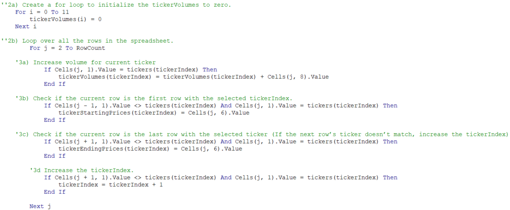
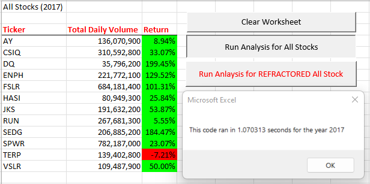
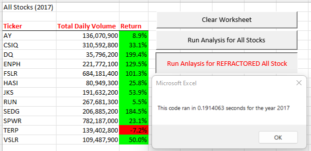
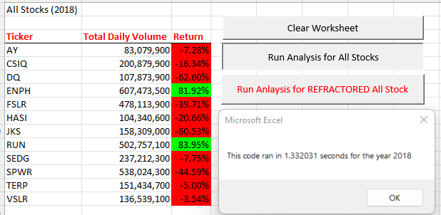

# All Stock Analysis Challenge

## Overview of Project

### Purpose
To identify which green-energy stocks are most likely to perform well for the client based on the total daily volume and return metrics calculated by Steve and the data analytics team. 

### Background
Steve, a finance graduate, approached the data analytics team to discuss the best method to analyzing stocks for his clients. His first clients happen to be his parents, who are primarily interested in investing into green-energy companies, especially DAQO New Energy Corporation (ticker: DQ). Steve’s clients initially wanted to invest all their money into DQ stock, but Steve knows it is best to have a diversified portfolio to mitigate any risk. For this reason, Steven and the data analytics team will listen to the client and provide an analysis of DQ stock but will also analyze various other green-energy companies to present to the client.

During the analysis Steve informed the data analytics team that the most important metrics to analyze for stock performance include the total daily volume and yearly return. The total daily volume is comprised of the total number of shares one stock is traded throughout a single day. The yearly return for each stock is the percent difference in price between the daily starting price and the daily ending price over a fiscal year. Those stocks with a high total daily volume and positive return rate are more appealing than those who may have negative returns and low trade volume.

## Results

### Code
The following link is the analysis document, with code, created by the data analytics team that demonstrates the metrics in action: [VBA Challenge](VBA_Challenge.xlsm). To analyze this vast amount of data the team created Visual Basic Application (VBA) code that would make this project more efficient and timelier for the client. The most impactful lines of code for this analysis include:
1.	A timer that tracked how long it took to run the analysis based on the year provided by the user in the input box:
    - *yearValue = InputBox("What year would you like to run the analysis on?")*
    - *startTime = Timer*
    - *endTime = Timer*
    - *MsgBox "This code ran in " & (endTime - startTime) & " seconds for the year " & (yearValue)*
2.	Initializing the variables that pull data needed to determine the total daily volume and yearly return:
    - *Dim tickers(12) As String*
    - *Dim tickerVolumes(12) As Long*
    - *Dim tickerStartingPrices(12) As Single*
    - *Dim tickerEndingPrices(12) As Single*
3.	Creating for loops to run through each row and column of data:

4.	Outputting the data into a table for easy visualization:
    - *For i = 0 To 11*
      - *Worksheets("All Stocks Analysis").Activate*
      - *Cells(4 + i, 1).Value = tickers(i)*
      - *Cells(4 + i, 2).Value = tickerVolumes(i)*
      - *Cells(4 + i, 3).Value = tickerEndingPrices(i) / tickerStartingPrices(i) – 1*
    - *Next i*

Once Steve and the data analytics team identified all the criteria needed to analyze the green-stocks, collected, organized, and analyzed the data, insights to the better performing stocks were identified. To Steve’s disbelief, for the fiscal year 2018, DQ stock had 107,873,900 stocks traded per day but a -63% yearly return. The unsatisfying return on this stock confirmed that Steve’s gut instinct on diversifying his client’s portfolio was correct. These findings led the data analytics team to incorporate more green-energy stocks and fiscal years data into the analysis. Twelve green-energy stocks were chosen for review that includes data for the 2017 and 2018 fiscal year. The stocks are index by their ticker code, which is a shortened identifier for each stock and include AY, CSIQ, DQ, ENPH, FSLR, HASI, JKS, RUN, SEDG, SPWR, TERP, and VSLR. Below are the results of the green-energy stock analysis for fiscal year 2017 and 2018.

### 2017 Results

As shown in the image above many of the selected green-energy stocks performed well during the 2017 fiscal year. The three tickers with the highest total daily volume include SPWR, FSLR, and CSIQ. The three tickers with the best yearly return include DQ, SEDG, and ENPH. No stock received both a top three spot in total daily volume and yearly return. What this tells Steve is that the DQ, SEDG, and ENPH had good returns but a low to intermediate total daily volume trading number indicating the overall activity around these companies to be uncertain. Individuals who invest in these types of companies are more likely to take risks and hope to reap great rewards in terms of return or dividends. However, that level of yearly return is unlikely to me maintained and prove the stock to be volatile. The green-stocks with the highest total daily volume, SPWR, FSLR, and CSIQ have many investors interested in both buying and selling stock and have a more realistic yearly return. These stocks may prove to be a better long-term solution for Steve’s clients if their goal is to mitigate high levels of risk.

### 2018 Results

As shown in the image above 2018 was not kind to many of the green-energy stocks Steve’s parents might be interested in. The positive gains of these stocks in 2017 deteriorated after unknown factors effected this industry in 2018. The only stocks to have positive yearly return and placed in the top three for highest total daily volume include ENPH and RUN. If we compare the 2017 and 2018 fiscal year results for these two stocks, we have the following:

As you can see in the comparison of ENPH and RUN stock their total daily volume increased over time from 2017 to 2018. This indicates the stock’s demand is appreciating and may maintain a more sustainable growth over time.  Those stocks who have low total daily volume can indicate a business who may be at the end of its life cycle and that there may be a lack of interest in the company from investors. Regarding the return metric, both companies had positive returns for both 2017 and 2018 meaning capital gains and/or dividend income for the investors, which is the ultimate  goal for investors. Although ENPH had a negative percent change in return for 2018, the stock is still appealing due to its high daily volume and yearly return.

### Recommendation

Based on the analysis above, the data analytics team and Steve have determined the following recommendations for the clients:
1.	Increase the diversification of your portfolio to include more than green-energy stock. For example, purchasing stock in the tech, health, and/or retail industries. This will mitigate risk by protecting the stock portfolio if one industry were to decrease it is unlikely all others will. It can also be beneficial to purchase different types of assets including bonds, CDs, real estate, and international stocks.
    - For more information visit the following link by Fidelity regarding portfolio diversification: https://www.fidelity.com/learning-center/investment-products/mutual-funds/diversification
2.	Invest in the following companies within the green-energy industry if the intention is long-term growth and sustainability. It is recommended that more money may be allocated to these stocks in comparison to those in recommendation three:
    - ENPH
    - RUN
3.	Invest in the following companies within the green-energy industry if the intention is short-term gain and acceptance of risk:
    - VSLR
    - SEDG
    - DQ
    - HASI
4.	Determine a schedule to review your stock choices quarterly and make adjustments as determined appropriate with the guidance of your financial representative, Steve.

## Summary

### Advantages & Disadvantages of Refactoring Code
It is important to understand that refactoring code does not mean we are changing the fundamental design of the code or the output. Instead, it is making the design of said code more efficient and easier to understand for the user by restructuring the existing code. It is simplest to view this process at a high-level when determining the advantages of refactoring code:
1.	It can improve the run time of VBA code making the overall process more efficient
2.	It can improve the overall design and flow of VBA code
3.	It can be easier to identify bugs, errors, or useful patterns

Below are the disadvantages of refactoring code:
1.	It may take more time to refactor code causing production to slow in the short-term
2.	It costs money (hourly wage or salary of data analyst to refactor code)
3.	It may be safer for the original code to not changed

For more information regarding refactoring code, it is recommended for all interested persons to read articles on Quora such as: https://www.quora.com/What-are-the-pros-and-cons-of-refactoring. Quora is a website that provides actual information and testimonials by real individuals in the data field. 

### Application of Refactoring Original Code

During this project, the data analytics team identified that both the original code and refactored code has its own unique advantages and disadvantages. Detailed in this section are the testimonials of those data analytics personnel. Regarding the original code, the team found that the code was more simplistic in its structure while providing accurate outputs. However, the run time of the original code was inefficient, and this sparked the idea for the team to refactor the code to run faster. The refactored code is lengthier than the original code as we initialized more variables that would improve the speed of the for loop and nested for loop. However, it took twice as long to write the refactored code than it did the original code. Overall, the team has preference over the refactored code as it proves more efficient for the team’s project load and can serve as a pattern to improve the efficiency of future projects code. Below are screens shots to demonstrate the change in the run time between the original code and the refactored code:

