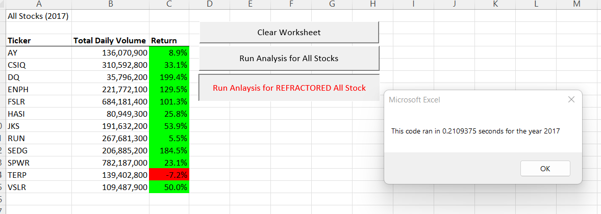
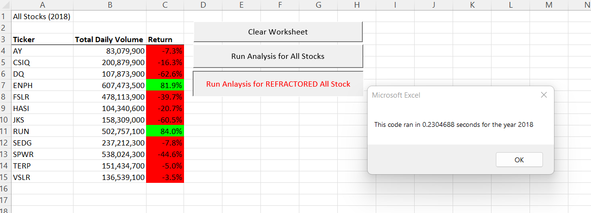
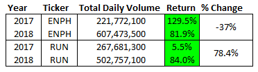

# All Stock Analysis Challenge

## Overview of Project

### Purpose
To identify which green-energy stocks are most likely to perform well for the client based on the total daily volume and return metrics calculated by Steve and the data analytics team. 

### Background
Steve, a finance graduate, approached the data analytics team to discuss the best method to analyzing stocks for his clients. His first clients happen to be his parents, who are primarily interested in investing into green-energy companies, especially DAQO New Energy Corporation (ticker: DQ). Steve’s clients initially wanted to invest all their money into DQ stock, but Steve knows it is best to have a diversified portfolio to mitigate any risk. For this reason, Steven and the data analytics team will listen to the client and provide an analysis of DQ stock but will also analyze various other green-energy companies to present to the client.

During the analysis Steve informed the data analytics team that the most important metrics to analyze for stock performance include the total daily volume and yearly return. The total daily volume is comprised of the total number of shares one stock is traded throughout a single day. The yearly return for each stock is the percent difference in price between the daily starting price and the daily ending price over a fiscal year. Those stocks with a high total daily volume and positive return rate are more appealing than those who may have negative returns and low trade volume.

## Results
Once Steve and the data analytics team identified all the criteria needed to analyze the green-stocks, collected, organized, and analyzed the data, insights to the better performing stocks were recognized. To Steve’s disbelief, for the fiscal year 2018, DQ stock had 107,873,900 stocks traded per day but a -63% yearly return. The unsatisfying return on this stock confirmed that Steve’s gut instinct on diversifying his client’s portfolio was correct. These findings led the data analytics team to incorporate more green-energy stocks and fiscal years data into the analysis. Twelve green-energy stocks were chosen for review that includes data for the 2017 and 2018 fiscal year. The stocks are index by their ticker code, which is a shortened identifier for each stock and include AY, CSIQ, DQ, ENPH, FSLR, HASI, JKS, RUN, SEDG, SPWR, TERP, and VSLR. Below are the results of the green-energy stock analysis for fiscal year 2017 and 2018.

### 2017 Results

As shown in the image above many of the selected green-energy stocks performed well during the 2017 fiscal year. The three tickers with the highest total daily volume include SPWR, FSLR, and CSIQ. The three tickers with the best yearly return include DQ, SEDG, and ENPH. No stock received both a top three spot in total daily volume and yearly return. What this tells Steve is that the DQ, SEDG, and ENPH had good returns but a low to intermediate total daily volume trading number indicating the overall activity around these companies to be uncertain. Individuals who invest in these types of companies are more likely to take risks and hope to reap great rewards in terms of return or dividends. However, that level of yearly return is unlikely to me maintained and prove the stock to be volatile. The green-stocks with the highest total daily volume, SPWR, FSLR, and CSIQ have many investors interested in both buying and selling stock and have a more realistic yearly return. These stocks may prove to be a better long-term solution for Steve’s clients if their goal is to mitigate high levels of risk.

### 2018 Results

As shown in the image above 2018 was not kind to many of the green-energy stocks Steve’s parents might be interested in. The positive gains of these stocks in 2017 deteriorated after unknown factors effected this industry in 2018. The only stocks to have positive yearly return include ENPH and RUN. If we compare the 2017 and 2018 fiscal year results for these two stocks, we have the following:

### Recommendation

## Summary

### Advantages & Disadvantages of Refactoring Code

### Application of Refactoring Original Code
